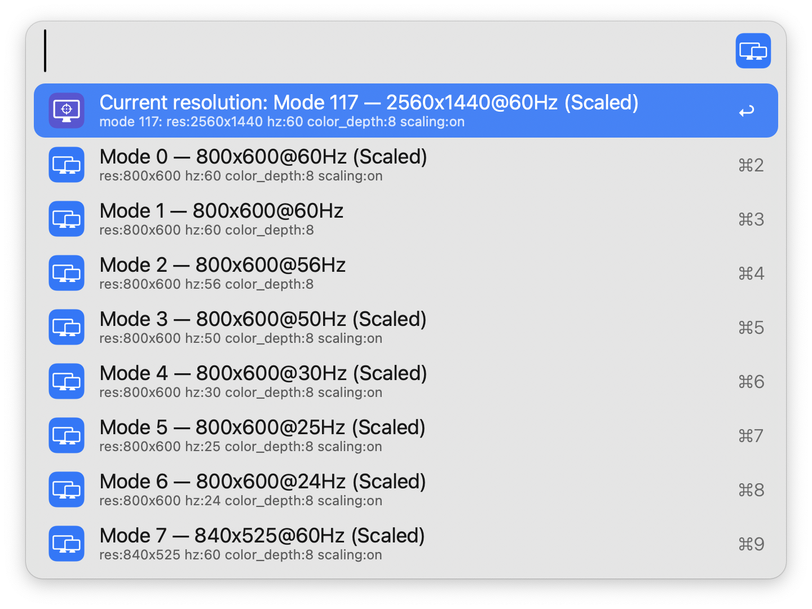

#  Resolution Changer

Quickly change the resolution of your displays in Alfred

[⤓ Install from the Alfred Gallery](https://alfred.app/workflows/firefingers21/resolution-changer/)

## Setup

This workflow requires [displayplacer](https://github.com/jakehilborn/displayplacer) to function, which can be installed [via Homebrew](https://formulae.brew.sh/formula/displayplacer).

## Usage

Search for available displays with the `resolution` keyword. Select a display to modify its resolution.

* <kbd>↩</kbd> Show resolutions for selected display
* <kbd>⌘</kbd><kbd>↩</kbd> Open Displays settings in System Settings

Select a resolution to activate it, or add a new resolution to favourites. Resolutions must be favourited before they can be activated.

* <kbd>↩</kbd> Activate favourited resolution
* <kbd>⌃</kbd><kbd>↩</kbd> Delete favourited resolution
* <kbd>⇧</kbd><kbd>↩</kbd> Return to Display Selection

Choose from the list of available resolutions to add as a favourite. Type to filter. The current resolution is always listed first.

* <kbd>↩</kbd> Add resolution to favourites
* <kbd>⇧</kbd><kbd>↩</kbd> Return to Favourites Selection

Configure the [Hotkey](https://www.alfredapp.com/help/workflows/triggers/hotkey/) as a faster shortcut to change resolutions.

**Note**: When adding favourites, it may be easier to first set the resolution in System Settings, then favourite the current resolution from the workflow as shown above.
